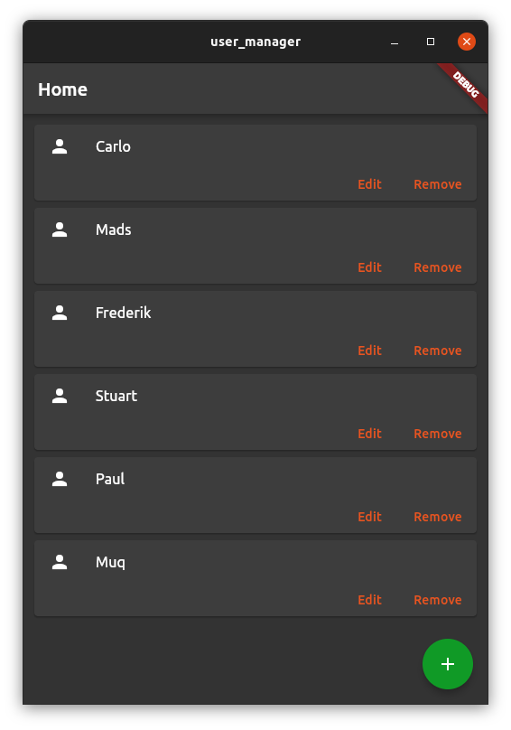
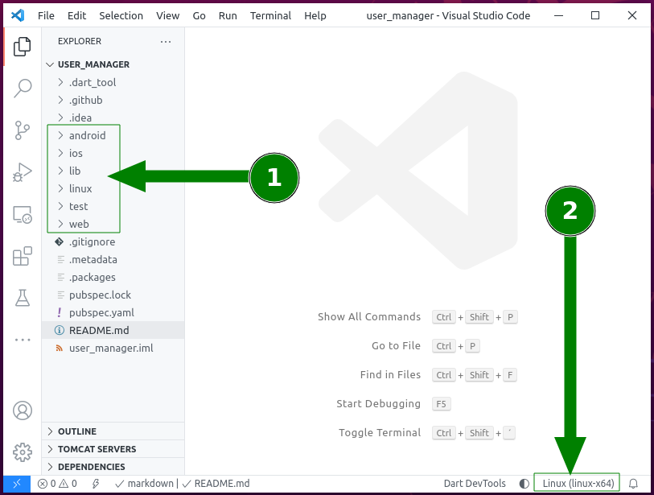
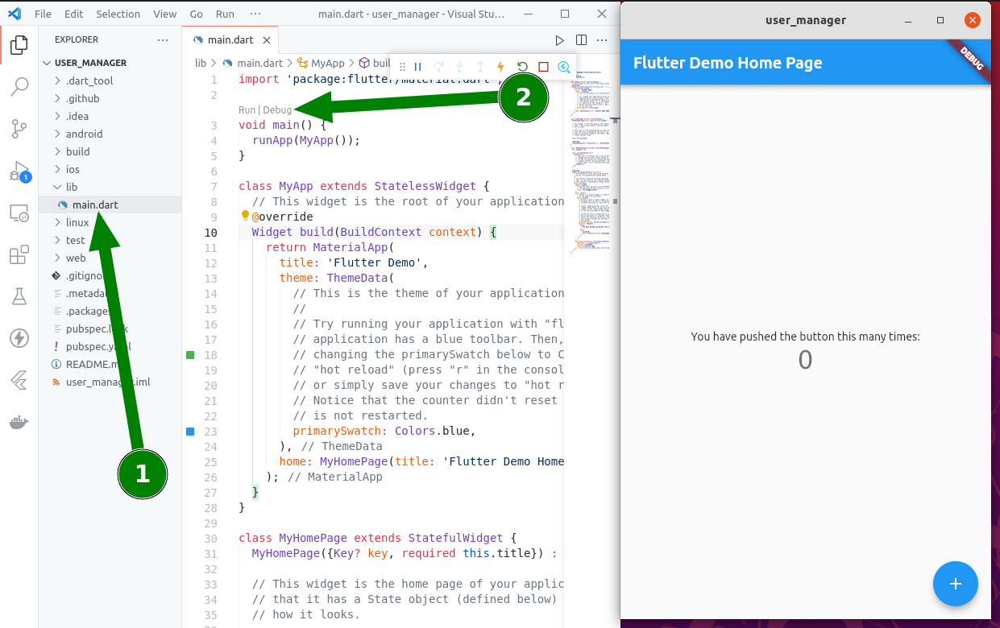
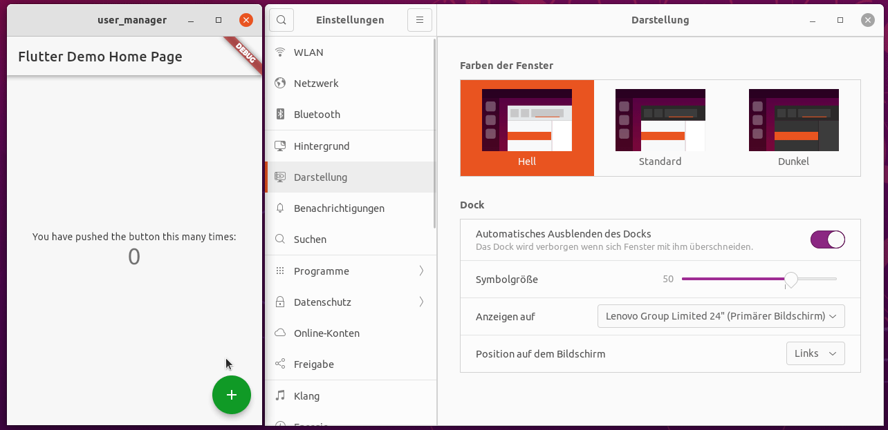
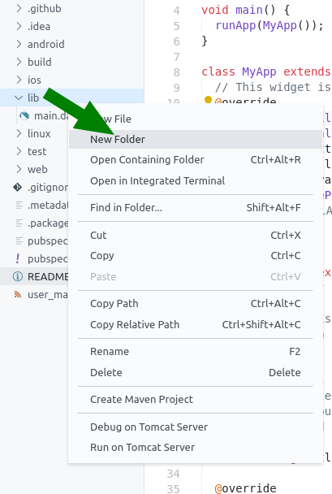
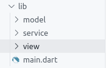
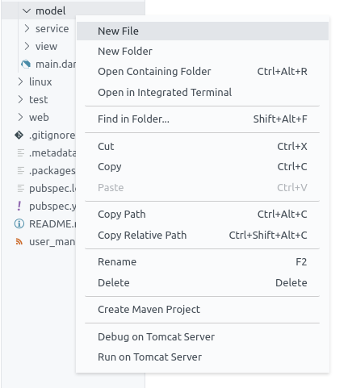
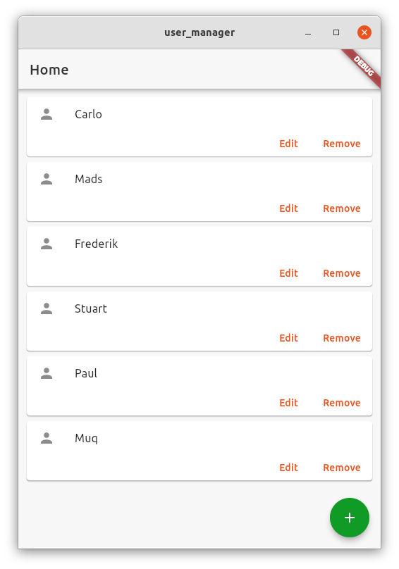

# Building a Yaru app with Flutter

|||
|---|---|
|**Summary**||
|**URL**|https://github.com/ubuntu/user_manager|
|**Category**||
|**Environment**|Linux|
|**Status**||
|**Feedback Link**||
|**Author**|Frederik Feichtmeier|

____

# Introduction

## What you'll learn

- Setting up a Flutter development environment in Ubuntu
- Building a Flutter app for the Linux desktop, using the [yaru theme](https://github.com/ubuntu/yaru.dart)
- Using [json-server](https://github.com/typicode/json-server) as a local backend to store data

## What you'll build



____

# Set up your Flutter environment

## Install Flutter on Ubuntu and enable flutter Linux desktop support

```bash
sudo snap install flutter
flutter channel beta
flutter upgrade
flutter config --enable-linux-desktop
```

## Install and setup Visual Studio Code

To install VS Code in Ubuntu fire up a terminal and run the following command:

```bash
sudo snap install code --classic
```

Launch VS Code Quick Open (Ctrl+P), paste the following command ...

```
ext install Dart-Code.flutter
```

... and press enter to install [the official Flutter VS Code extension](https://marketplace.visualstudio.com/items?itemName=Dart-Code.flutter).

# Get started

Open a terminal or the VS Code integrated terminal and run the following command to create a new flutter project for the fictional organization `org.flutterfans`

```bash
flutter create --org org.flutterfans user_manager
```

Open the project directory `user_manager` you've just created with VS Code.


You should now see the following directories (1) and the "Linux (linux-x64)" (2) device in use, which is the default on Linux after you've enabled the linux desktop support:



Let's make a small test if the application launches, by opening the `lib` directory (1) and clicking on the small `Run` label above `void main()` (2) 



## Using the Yaru theme

Open `pubspec.yaml` - the file for managing of the lifecycle of your app - and add `yaru: ^0.0.6` under the dependencies section, so you end up with the following dependencies (check that `yaru` is on the same column as `flutter`): 

```yaml
dependencies:
  flutter:
    sdk: flutter
  yaru: ^0.0.6
```

You can now import the yaru theme by adding 

```dart
import 'package:yaru/yaru.dart' as yaru;
```
at the top of `main.dart`. Use the yaru theme in your app by setting the `theme` property of `MaterialApp` to `yaru.lightTheme` and the `darkTheme` property to `yaru.darkTheme` so you end up with the following class definition - your app now follows your system's theme.

```dart
class MyApp extends StatelessWidget {
  @override
  Widget build(BuildContext context) {
    return MaterialApp(
      title: 'Flutter Demo',
      theme: yaru.lightTheme,
      darkTheme: yaru.darkTheme,
      home: MyHomePage(title: 'Flutter Demo Home Page'),
    );
  }
}
```



# Building the app

## Organize your project structure

You might want to organize your project's directory structure a little bit. Start by creating a `view` directory under `lib` by right-clicking the `lib` directory and click the `New folder` menu entry and type in `view` into the textfield that pops out.



Repeat this step with a `model` and a `service` directory to end up with the following directory tree above `main.dart`:



## A simple user model

To easily send user data across your app and to the server you want to have a user class, containing only the data properties of your user.

Right-click on the `model` directory and click on `New file` and name it `user.dart`:



Insert the following code

```dart
class User {
  int? id;
  String name;

  User({required this.id, required this.name});

  User.empty() : this(id: null, name: "");

  factory User.fromJson(Map<String, dynamic> json) =>
      User(id: json['id'], name: json['name']);

  Map<String, dynamic> toJson() => {"id": id, "name": name};
}
```

## The user service

To let your app communicate via HTTP with your server, add `http: ^0.13.1` in your `pubspec.yaml` under the `dependencies` section, create `user_service.dart` in the `service` directory and paste the following code into:

```dart
import 'dart:convert';

import 'package:http/http.dart' as http;
import 'package:user_manager/model/user.dart';

class UserService {
  UserService({required this.uri});

  final String uri;

  Future<List<User>> getUsers() async {
    final response = await http.get(Uri.http(uri, 'users'));

    if (response.statusCode == 200) {
      var usersJson = jsonDecode(response.body.toString()) as List;
      return usersJson.map((json) => User.fromJson(json)).toList();
    } else {
      throw Exception(response.statusCode.toString() + ': ' + response.body);
    }
  }

  Future saveUser(User user) async {
    for (var aUser in await getUsers()) {
      if (aUser.id == user.id) {
        await updateUser(user);
        return;
      }
    }
    await addUser(user);
  }

  Future<http.Response> addUser(User user) async {
    return await http.post(Uri.http(uri, 'users'),
        headers: <String, String>{
          'Content-Type': 'application/json; charset=UTF-8',
        },
        body: jsonEncode(user.toJson()));
  }

  Future updateUser(User user) async {
    return await http.put(Uri.http(uri, 'users/${user.id}'),
        headers: <String, String>{
          'Content-Type': 'application/json; charset=UTF-8',
        },
        body: jsonEncode(user.toJson()));
  }

  Future removeUser(User user) async {
    await http.delete((Uri.http(uri, 'users/${user.id}')));
  }
}
```

## The UI

### One card for each user

Each user that will be managed is represented by a card inside the UI.

Create `user_card.dart` in the `view` directory and paste in the following code

```dart
import 'package:flutter/material.dart';
import 'package:user_manager/model/user.dart';

class UserCard extends StatefulWidget {
  final User user;
  final VoidCallback onDelete;
  final VoidCallback onEdit;

  UserCard({required this.user, required this.onDelete, required this.onEdit});

  @override
  _UserCardState createState() => _UserCardState();
}

class _UserCardState extends State<UserCard> {
  @override
  Widget build(BuildContext context) {
    return Card(
      child: Column(
        mainAxisSize: MainAxisSize.min,
        children: <Widget>[
          ListTile(
            leading: Icon(Icons.person),
            title: Text(widget.user.name),
          ),
          Row(
            mainAxisAlignment: MainAxisAlignment.end,
            children: <Widget>[
              TextButton(
                child: const Text('Edit'),
                onPressed: () => widget.onEdit(),
              ),
              const SizedBox(width: 8),
              TextButton(
                child: const Text('Remove'),
                onPressed: () => widget.onDelete(),
              ),
              const SizedBox(width: 8),
            ],
          ),
        ],
      ),
    );
  }
}
```

### A dialog to edit users in

A user will be edited inside a dialog, spawned from clicking on the either the big green floating action button or the edit button of your user card.

Create the file `user_edit_dialog.dart` inside the `view` directory and copy/paste the following code into:


```dart
import 'package:flutter/foundation.dart';
import 'package:flutter/material.dart';
import 'package:flutter/widgets.dart';

class UserEditDialog extends StatefulWidget {
  final TextEditingController nameController;
  final AsyncCallback editUser;

  UserEditDialog({required this.nameController, required this.editUser});

  @override
  _UserEditDialogState createState() => _UserEditDialogState();
}

class _UserEditDialogState extends State<UserEditDialog> {
  @override
  Widget build(BuildContext context) {
    return Dialog(
      child: Container(
        height: 150,
        width: 200,
        child: Padding(
          padding: const EdgeInsets.all(10.0),
          child: Column(
            mainAxisAlignment: MainAxisAlignment.start,
            crossAxisAlignment: CrossAxisAlignment.start,
            children: [
              Padding(
                padding: const EdgeInsets.all(8.0),
                child: TextField(
                  autofocus: true,
                  controller: widget.nameController,
                  decoration: InputDecoration(hintText: 'User name'),
                ),
              ),
              Row(
                children: [
                  Padding(
                    padding: const EdgeInsets.all(8.0),
                    child: ElevatedButton(
                      onPressed: () async =>
                          Navigator.of(context).pop(widget.editUser()),
                      child: Text(
                        "Save",
                        style: TextStyle(color: Colors.white),
                      ),
                    ),
                  ),
                  Padding(
                    padding: const EdgeInsets.all(8.0),
                    child: TextButton(
                      onPressed: () => Navigator.of(context).pop(),
                      child: Text("Cancel"),
                    ),
                  )
                ],
              ),
            ],
          ),
        ),
      ),
    );
  }
}
```

### The new home page

The old home page won't be enough anymore so you need a new one to load the user cards into. The home page uses the user service to manage the user data.

Open your `pubspec.yaml` file again and add `injector: ^2.0.0` in the `dependencies` section. Create the file `home_page.dart` in the `view` directory and paste the following code:

```dart
import 'package:flutter/material.dart';
import 'package:flutter/widgets.dart';
import 'package:injector/injector.dart';
import 'package:user_manager/model/user.dart';
import 'package:user_manager/service/user_service.dart';
import 'package:user_manager/view/user_card.dart';
import 'package:user_manager/view/user_edit_dialog.dart';

class HomePage extends StatefulWidget {
  @override
  _HomePageState createState() => _HomePageState();
}

class _HomePageState extends State<HomePage> {
  late TextEditingController _nameController;
  final _userService = Injector.appInstance.get<UserService>();

  @override
  void initState() {
    _nameController = TextEditingController();
    super.initState();
  }

  @override
  Widget build(BuildContext context) {
    return Scaffold(
      appBar: AppBar(
        title: const Text('Home'),
      ),
      body: Center(
        child: Padding(
          padding: const EdgeInsets.all(8.0),
          child: Scrollbar(
            child: FutureBuilder(
                future: _userService.getUsers(),
                builder: (context, AsyncSnapshot<List<User>> snapShot) {
                  if (snapShot.hasData) {
                    return ListView(
                      children: snapShot.data!
                          .map((user) => UserCard(
                              user: user,
                              onDelete: () {
                                _userService
                                    .removeUser(user)
                                    .then((value) => setState(() {
                                          _showSnackBar(
                                              'Deleted user: ' + user.name);
                                        }))
                                    .onError((error, stackTrace) =>
                                        _showSnackBar(error.toString()));
                              },
                              onEdit: () => editUser(user, context)))
                          .toList(),
                    );
                  }
                  return CircularProgressIndicator();
                }),
          ),
        ),
      ),
      floatingActionButton: FloatingActionButton(
        child: Icon(Icons.add),
        onPressed: () {
          _nameController.text = "";
          editUser(new User.empty(), context);
        },
      ),
    );
  }

  void editUser(User user, BuildContext context) {
    _nameController.text = user.name;
    showDialog(
        context: context,
        barrierDismissible: false,
        builder: (BuildContext context) {
          return UserEditDialog(
              nameController: _nameController,
              editUser: () async {
                user.name = _nameController.text;
                _userService
                    .saveUser(user)
                    .then((value) => setState(() {
                          _showSnackBar('Saved user: ' + user.name);
                        }))
                    .onError(
                        (error, stackTrace) => _showSnackBar(error.toString()));
              });
        });
  }

  void _showSnackBar(String message) {
    ScaffoldMessenger.of(context).showSnackBar(
        SnackBar(duration: const Duration(seconds: 1), content: Text(message)));
  }
}
```

## Finish up your main.dart

The UI of the test app is no longer needed. Remove all Widgets except `MyApp`, change the `home` property to `HomePage()`, change your `main()` function to by asynchronous, returning a `Future<void>` and register your `UserService` with the `Injector` class before you run your app. To be sure you've imported everything correctly, replace all code inside `main.dart` with the following new version:

```dart
import 'package:flutter/material.dart';
import 'package:injector/injector.dart';
import 'package:user_manager/service/user_service.dart';
import 'package:user_manager/view/home_page.dart';
import 'package:yaru/yaru.dart' as yaru;

Future<void> main() async {
  final userService = UserService(uri: 'localhost:3000');
  Injector.appInstance.registerDependency<UserService>(() => userService);
  runApp(MyApp());
}

class MyApp extends StatelessWidget {
  @override
  Widget build(BuildContext context) {
    return MaterialApp(
      title: 'Flutter Demo',
      theme: yaru.lightTheme,
      darkTheme: yaru.darkTheme,
      home: HomePage(),
    );
  }
}
```

## Create a local server to process client requests

### Create mock data

Create `db.json` inside the root folder of your application and insert some fictional users in the json format:

```json
{
    "users": [
        {
            "id": 1,
            "name": "Carlo"
        },
        {
            "id": 2,
            "name": "Mads"
        },
        {
            "id": 3,
            "name": "Frederik"
        },
        {
            "id": 4,
            "name": "Stuart"
        },
        {
            "id": 5,
            "name": "Paul"
        },
        {
            "id": 6,
            "name": "Muq"
        }
    ]
}
```

### Install node-js and json-server

We will use a [fantastic local mock server](https://github.com/typicode/json-server) to let our client talk to. To do so we need the [node snap](https://snapcraft.io/node). Enter the following commands to install node and json-server.

```bash
sudo snap install node --classic
sudo npm install -g json-server
```

# Entering the user management :)

Start your json-server by running the following command

```bash
json-server --watch db.json
```

Start your app again! Done :) You can now manage users inside a Ubuntu Linux app, using the yaru theme:

